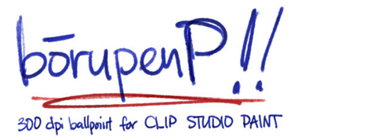

# BorupenP - Office and School Supply Brushes for Clip Studio Paint
## Changelog

- **Shop page:** [https://ko-fi.com/pharanbrush/shop](https://ko-fi.com/pharanbrush/shop)

---

### 2020 Jan 29

**MAJOR UPDATE**

Added the other school-themed brushes. Highlighters. Dry erase markers. and School EnpitsuP.

### 2019 Oct 1

Added custom icons for the main brushes.

### 2019 Sep 4

Added the "Shapes" folder. Includes Rectangle and Line tool versions of the one-color gel and ballpens.

### 2019 July 28

I've updated the BorupenP (non gel) brush shapes to be even more ballpeny than before!

---

Some helpful reading:
- [How to install CSP brushes](how-to-install-csp-brushes/)
- [Too many brushes? Brush Management Tips for Clip Studio Paint](brush-management-tips/)
- [Pen direction support in Clip Studio Paint](/clip-studio-paint-direction-of-pen/)

