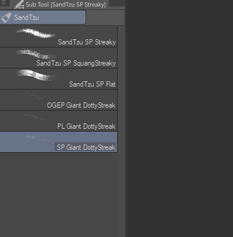

# Brush Management Tips for Clip Studio Paint

When you're painting or drawing, you don't want to spend half the time hunting and scrolling for that brush you want in a long, messy list.

If you only have a few brushes, you'll probably get by. But there comes a point when you accumulate so many brushes from various sources— brushes and brush packs you download, or ones you make yourself— that it can get a little overwhelming.

Some people just learn to avoid switching brushes because they assume it'll always be inconvenient (other programs don't provide a lot of options when it comes to organizing your brushes and keeping the important ones within reach).

Luckily, Clip Studio Paint actually gives you a pretty good amount of flexibility for organizing your brushes and tools and setting shortcuts. And a little reorganization and a few shortcuts go a long way in making brush-picking a task you don't even have to think about.

So I'll outline some tips here to get you started on some simple brush management.

I'll talk about 1. **organizing brush groups**, 2. **setting shortcuts**, and finally, 3. **reusing shortcuts and reordering groups to make your brush-picking lightning-fast**.

1. **In Clip Studio Paint, brushes are organized into a two-level folder structure**:
1

- Every brush or sub tool belongs in a Sub Tool Group.
- Every Sub Tool Group belongs to a Tool.
- Each Tool can have several Sub Tools. Each Sub Tool Group can hold several Sub Tools or brushes.

The [Tool] palette/sidebar also has separators. You can split tools between separators by dragging a tool onto an existing separator. A red indicator will show a long horizontal line over the separator to show that it will make a new one.

**You can group brushes into "sub tool groups". They act as tabs in the Sub Tool window.**

To make a new group: drag any brush into an empty space above the brush list. You can also drag it to the tiny space between existing groups. A red indicator will show where the group will be created.

To move a brush to an existing group: drag that brush onto that group's tab. A red box will show where the brush will go when you release it.

You can change the order of these tabs by dragging them like tabs on a browser.

**You can make NEW tools in the [Tool] sidebar. As many as you sanely want.**

To make a new tool: drag any sub tool group into an empty space on the [Tool] sidebar or between existing tools. The red indicator will show where the new tool will be inserted.

Dragging an individual brush to the [Tool] sidebar will also make a new tool and a new subtool group for that one brush.

Both individual brushes and subtool groups can be moved between existing tools in the [Tools] sidebar. The red indicator will show up as a red box around the tool to show where the brush or group will go when you release it.

**Sometimes you want to get rid of a brush you don't use much but don't want to delete it yet. You can move those brushes to a "Recycle Bin" group or tool so they're out of your way but you can dig them up if you need them.**

If you want to delete several brushes at once, group those brushes into a tool, and delete that tool. If you right-click on a tool and choose [Delete tool...], it will delete all the brushes under it. Be careful! Make sure you have a copy of your important brushes.

**2. Sometimes you edit an existing brush and don't want to lose your settings.**

If you fiddle with your settings and get it just right for your needs, but don't want to lose your original brush, you can use [Duplicate sub tool...]. Just right-click on a brush to access it.

In addition to duplicating the sub tool, you can use [Save as default] to save your current settings as the brush's default. You can use [Reset to default] later to restore those settings you saved.

If you want to back up your special brush, you can right-click that brush and choose [Export sub tool...]. Save it to Dropbox, Google Drive or some other online storage/backup service.

**3. Now for Shortcuts!**

You can set shortcuts for tools, sub tool groups, and specific brushes.

Go to File>[Shortcut Settings...] (in Windows). And choose "Tool" under the Setting area dropdown.

Choose "Tool" under the Setting area dropdown.

Like other programs, you can set shortcuts for tools.

But **Clip Studio Paint also lets you set shortcuts for individual brushes and sub tool groups.**

Here's where shortcuts become really powerful

**You can reuse the same shortcut for different brushes. Pressing the key repeatedly will cycle through those brushes.**

For example, if you assign the | key for multiple different rulers, pressing | key repeatedly will cycle through the different ruler sub tools.

The order they're cycled through depends on the order of the brushes/sub tools in their list.

**You can also reuse shortcuts for sub tool groups. Pressing the key repeatedly will give you the same cycling behavior.**

For example, if you assign the R key for watercolor sub tool group, and also for the acrylics sub tool group, pressing R repeatedly will switch you between watercolors and acrylic groups.

The order they're cycled through depends on the order of their tabs.

This means after you organize your brushes into groups, you can give similar groups the same shortcut key.

And depending on your needs at the moment, you can reorder your group tabs and brush lists according to what you want your shortcut to give you immediately.

For example: for one task, you may want your "F" key to be primarily for painting using a plain, smooth brush. For your next task or next painting, you may want "F" to use a grainy brush. Instead of having to dig through the shortcuts all the time, you can just reorder your tabs and lists to have easy reach for what you want at the moment, then easily change the order again later when your task or technique or style changes.

**Using this can also free up your other keys for other tools.**

For example, "L" can be used for the Lasso selection tool. But you can also use L for the rectangle select and polyline select tools. This can free up your "M" key for use with mixers and blenders.

Just having that key for blenders can open up possibilities for you to use an efficient and no-stress paint-then-blend technique.

In summary...

**Group your brushes into sub tool groups and tools** according to any category scheme that makes sense to you, so if you know you need something, you'll instantly know where to find it.

And for brushes or tools you use most often, **set key or button shortcuts** to help you easily reach them without even moving your pen away from your canvas!

When you reuse keys for multiple groups or brushes, **the order of the groups and brushes will change the order the shortcut cycles through them**. So change them as often as you want depending on what you're doing.

That's all the tips I have for now. Happy drawing and painting!

For more Clip Studio Paint brush tips, you can follow me on Twitter [@PharanBrush](https://twitter.com/PharanBrush)

I also make paid and free brushes for Clip Studio Paint! Check them out here: [https://ko-fi.com/pharanbrush/shop](https://ko-fi.com/pharanbrush/shop)