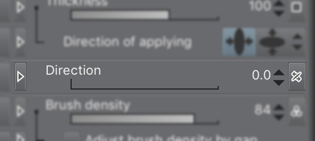
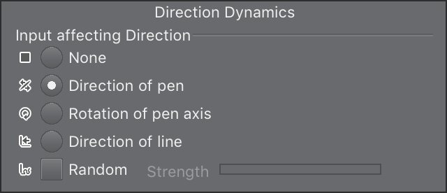
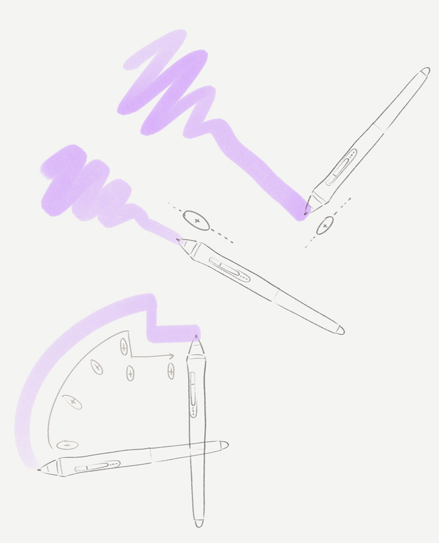

# Pen direction support in Clip Studio Paint

In Clip Studio Paint, brushes have a “Direction” setting. This determines the rotation of the brush shape when it’s painted onto the canvas.

Direction slider in the subtool settings.

The direction of a brush can have dynamics that are based on things like pen direction, pen rotation or direction of line. This post describes how **“Direction of pen”** works.

Direction Dynamics settings popup.

**Direction of pen** is the *direction* of pen tilt, as opposed the amount of pen tilt (how much the pen is horizontal or vertical). Pen direction is the angle of the pen (up, down, left, right and everything in between) you see when you look straight down on your drawing surface.

Illustration of a tall brush dynamically pointing in the direction of the pen.

Some custom brushes are designed with this feature, meaning they work best when the device supports it. Most EMR pens that support tilt usually also support detecting pen direction, since they rely on the same underlying technology.

If your device doesn’t support this feature, Clip Studio Paint will ignore it. The brush will usually default at a zero angle, as if the pen was pointing forward. In this case, you can change the “Direction” setting slider to suit your needs.

### Some pens and tablets that include pen tilt and direction:
- Wacom Intuos Pro (including Intuos 2 to 5)
- Wacom Cintiq (and Mobile Studio series)
- Apple Pencil
- Microsoft Surface pen
- Some Huion Pen tablets/screens since 2018.
- Some XP-pen tablets/screens since 2019.

Make sure you check your pen tablet/pen screen’s official website to see if it supports tilt and pen direction.

**Further reading**
Here’s an interesting article on the technology behind pen tilt detection: https://essentialpicks.com/tilt-sensitivity-and-rotation-in-stylus/