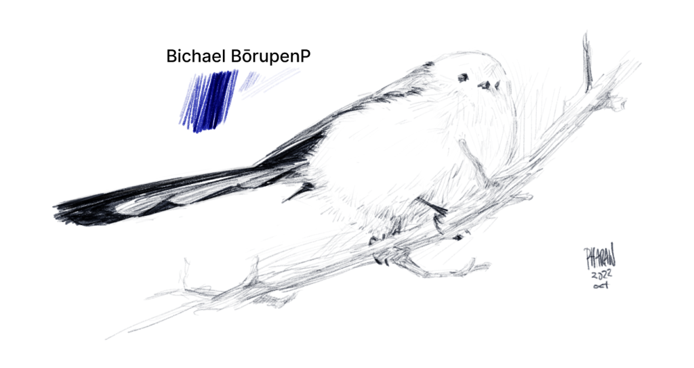
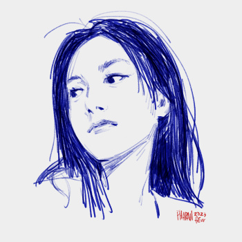
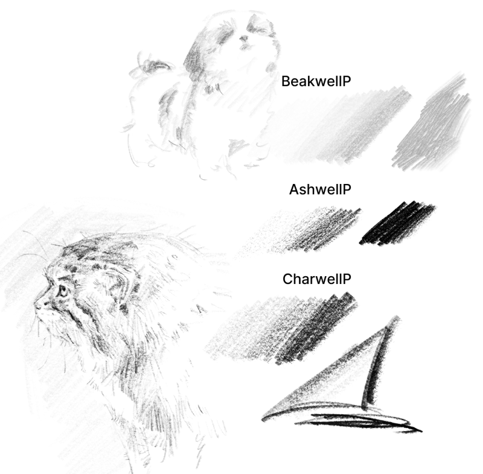
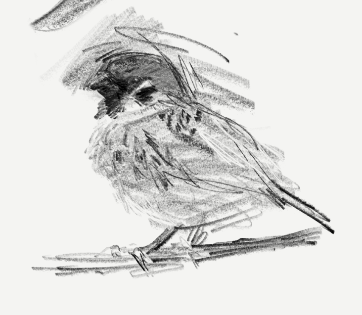
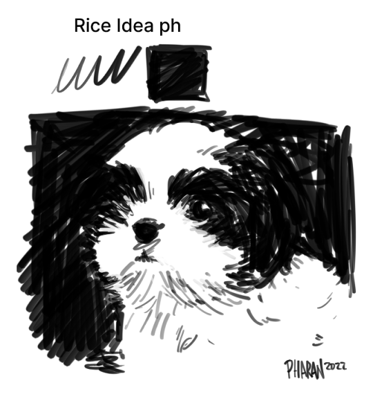
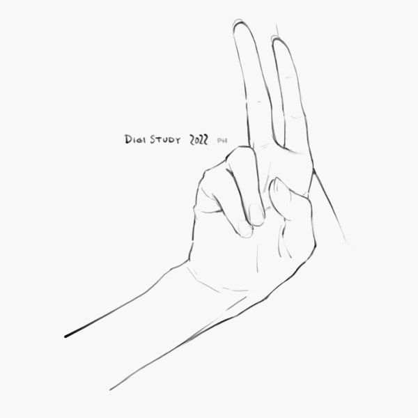
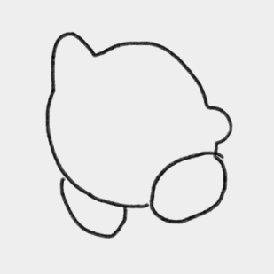
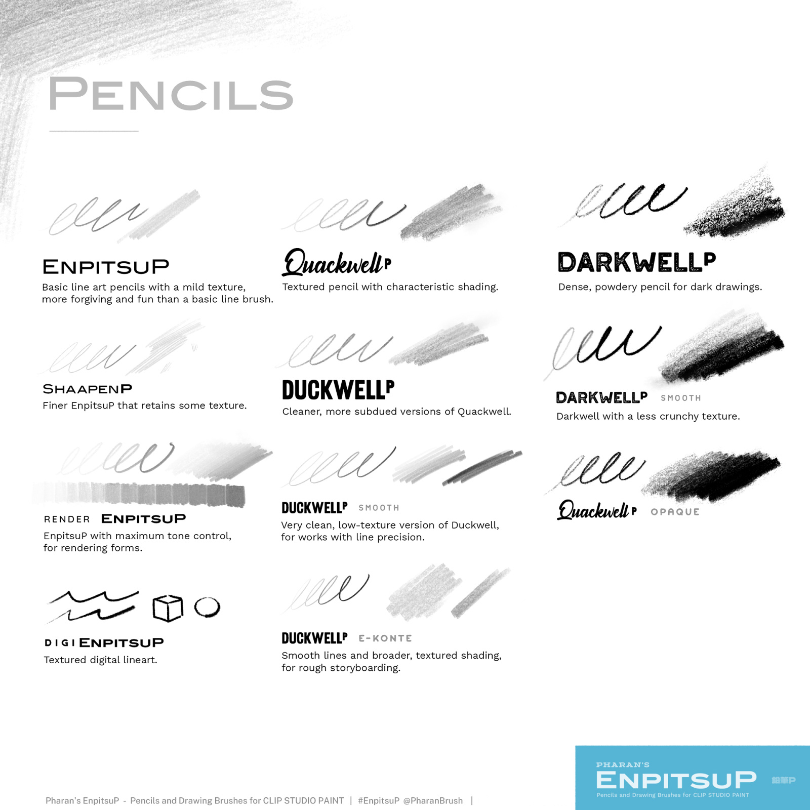
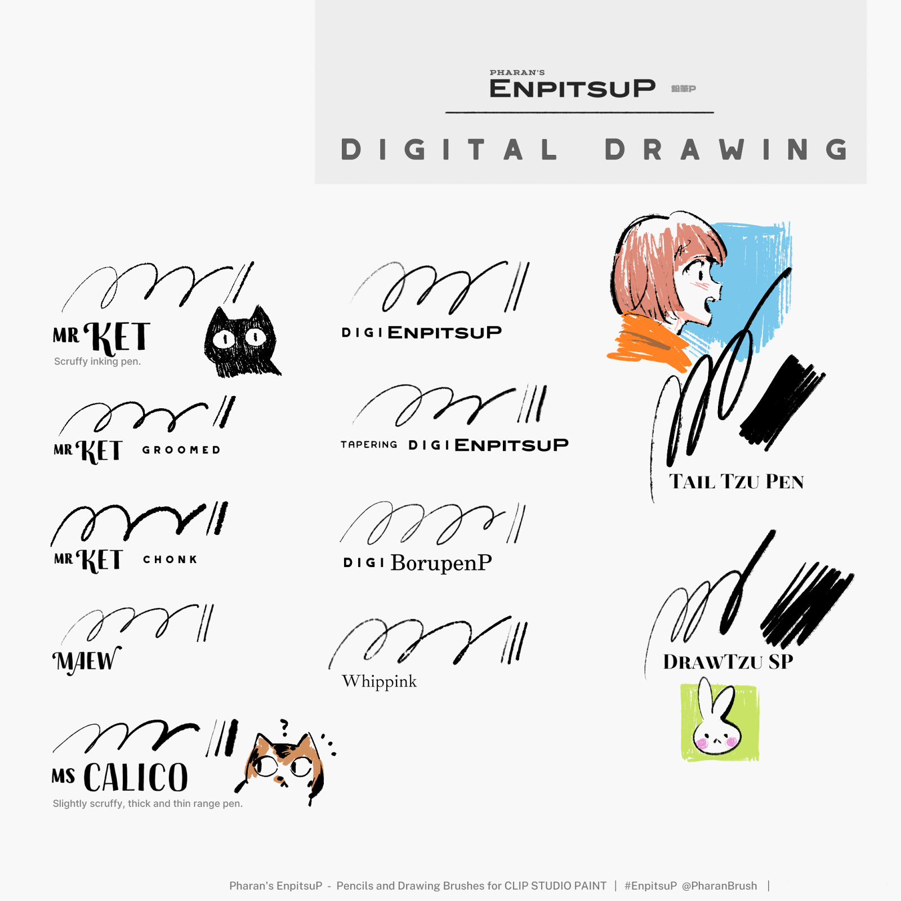
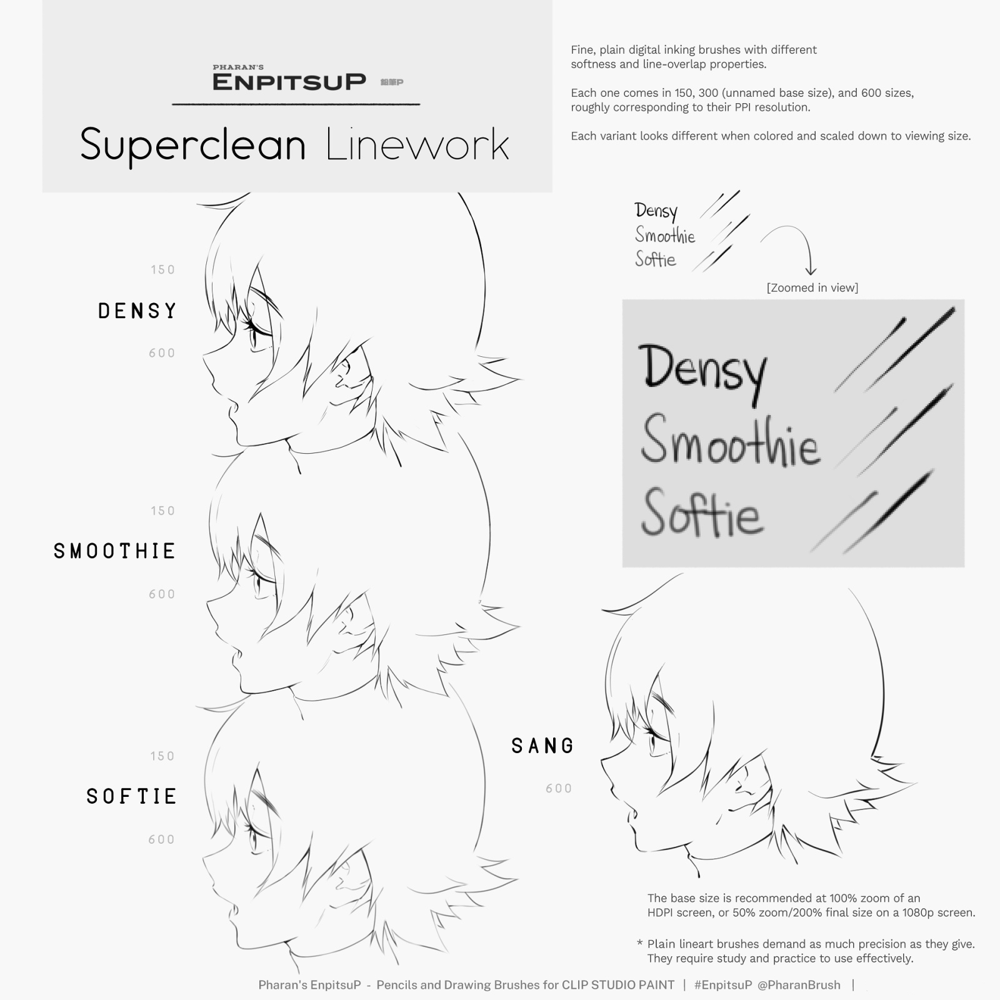

# EnpitsuP - Pencils and Drawing Brushes for Clip Studio Paint
## Changelog

- **Shop page:** [https://ko-fi.com/pharanbrush/shop](https://ko-fi.com/pharanbrush/shop)  
- **Overview:** [EnpitsuP overview](../enpitsup-overview)  

---
## 2023

### 2023 Jun 1
Renamed the "Getting Started" file to "Sampler Set".

### 2023 May 13

Added the "Getting Started" file. You can [read more about the Getting Started files](../getting-started).

### 2023 Feb 8

### What's new?

New [EnpitsuP map](img/enpitsup/enpitsup-obsidian-map.png). Some people inevitably understand the organization better visually, so I'm making a map of the EnpitsuP brushes starting with the pencils.

**Bichael BōrupenP** (BōrupenP Plus)  
  
A cleaner, more controllable, slightly more render-capable ballpoint pen brush. Named for the slightly cheap but flowly ballpoint ink it mimics, on a nice clean sketchbook. You can read more about Bichael BōrupenP here: [https://www.tumblr.com/pharanbrush-log/708760186194624512](https://www.tumblr.com/pharanbrush-log/708760186194624512)

**New Side Pencils**  

**AshwellP Side**, **BeakwellP Side**. **CharwellP Side**  
  
These are some general-use pencils that feel more pencil-y by default, analogous to default pencils in tablet apps.

These are less line-drawing-centric than the main EnpitsuP pencil brushes. 

  
CharwellP Side  

**Rice Idea ph**  
  
Fun little digital sketch brush that occasionally feels like a black sketch marker. This first debuted as one of the Settei brushes but I had already created this brush long before that. The tip is shaped like a short rice grain.

**DigiStudy 2022** - A clean digital sketch brush I used in 2022.  

  

Added **Settei Enclose Fill** tools for convenient filling that matches most Settei thickness.  

### Updated
Updated **IroEnpitsuP 2022** to replace IroEnpitsuP 2021. The new texture is more even for better shading. 

Renamed [*DuckwellP Chewed*] to **HonkwellP**.

Moved Suisai and RoughPaper pencils to **Suisai Prep** folder.

QuackwellP Fade, EnpitsuP 2020, IroEnpitsuP 2021 have been moved to Legacy.
DuckwellP Circle has be removed.  

## 2022

### 2022 Oct 27

Minor correction: The fixed-color *Green DuckwellP* brush was missing. It's now included in the main set with the others, under Brushes > 1. Enpitsu > 2. Fixed Color EnpitsuP

### 2022 Jul 23

Uploaded the release version of EnpitsuP Settei.

You can find out more about it here: https://pharanbrush-log.tumblr.com/post/690514861842726912/

### 2022 May 15

Uploaded the beta version of the EnpitsuP Settei set. Still working on the documentation.

### 2022 Feb 21

Some minor rearrangment of files to better reflect the promotional materials.

The **Mr Ket set** is now part of the main file in the Digital Drawing folder, instead of in the separate common digital drawing set.

---
## 2021

### 2021 Sep 20

Added **IroEnpitsuP 2021**. A 3-stage tilt version of IroEnpitsuP for both lines and shading.

Added **Rule Lines Borupen** to BorupenP Plus, a Ballpoint pen parallel line tool.

I've uploaded a beta version of the shading-and-rendering-centric Render EnpitsuP pencils: **Render HoneybeerP**, **Render QuackwellP**, **Render DotwellP**, **Render StumpwellP** and **StumpitsuP**. They can be found in a separate zip file.(These brushes require pen tilt support.)

### 2021 Aug 2

Added **BorupenP WobbleWrite** to BorupenP Plus. It's like writing on a sheet of paper with a rough surface underneath. (Updated this twice today to improve the light-pressure shading behavior.)

### Jul 2021

**MAJOR UPDATE**

Added **DarkwellP** and some **extra variations of QuackwellP**.

Added **DuckwellP EKonte** - which combines clean pencil lines and textured tilt shading of DuckwellP. Replaced the main fixed color pencils with DuckwellP EKonte.

Added **Tail Tzu Pen** a ruff drawing brush pen.

Added **DuckwellP Chewed**. A roughened outline version of DuckwellP.

Added **BorupenP Plus**.

Added **Whippink** (the drawing-version the line brush from the Tapioca Whip Chalk set).

**Renamed and retuned the Superclean Linework brushes**. These are plain digital inking brushes that have different density, softness and overlapping characteristics. The base unnamed size is now the "300 dpi" set (previously labeled 2x). The small version is labeled 150, and the large version labeled 600. These correspond to the ideal ppi they're used at. There's a guide image that better illustrates their differences in the "Tips" folder.

**Updated the images and previews** to be more descriptive and less chaotic.

Fixed: **Ms Calico** was added to the "Digital Drawing PharanBrush Common" file.

### 2021 Jul 23

Added **BorupenP Plus**. Gumroad puts a size limit on free items so I'm putting the extra special but BorupenP-related brushes here. This now contains:

- **KureyonP**
- **ChalkwellP**
- Double-line versions of BorupenP
- Hatchy BorupenP brushes
- related erasers.

---

## 2020

### 2020 Oct 21

Added new pencils: **QuackwellP** and **DuckwellP** ! Also moved **SmudgepitsuP** out of the meme folder because it turned out it's more broadly applicable.

### 2020 Oct 8

Added **GraphiteP** and updated the documentation to explain settings and to reflect the EnpitsuP pack's variety.

### 2020 Aug 28

***VERSION 3.0 RELEASE***

EnpitsuP set now includes both pencils and various non-pencil drawing tools and inkers!

Added **BorupenP ShortHatches** - a hatching shading ballpoint pen brush.

### 2020 Apr 12

**Fixed Color EnpitsuP** - I've included 4 new EnpitsuP variants that come with a color (and ignore the color you selected). This is useful for when you want to frequently switch between colors AND brushes or don't want to lose the color you selected.

It can be especially useful on iPad or keyboardless Cintiq setups where changing the tool and the color may require a lot of extra hand movement.

### 2020 Mar 1

IroEnpitsuP F texture fix. The texture repeat on the F variants of IroEnpitsuP has been doubled and patched up to greatly reduce the obvious repeating pattern.

### 2020 Feb 2

**Render EnpitsuP** : This is EnpitsuP with curves adjusted a bit for less randomness and more control, to allow it for use in carefully rendering forms. Also reduced the texture density a bit to that end.

---

## 2019

Oct 8

MAJOR UPDATE. Added GraphiteP and updated the documentation to explain settings and to reflect the EnpitsuP pack's variety.

Oct 3

Added extra IroEnpitsuP variants for more grain choices, some adjustments to existing brushes. New Tapering DigiEnpitsuP.

Sep 27

Slight update to EnpitsuP, and exposed the direction slider, slight tilt response to add slight size and opacity variation when tilted.

Plus a bonus message.

Sep 17

Added RoughPaper EnpitsuP and Susai Sketch EnpitsuP

These are faint pencils designed to be used for minimal undersketches for watercolors, gouache or other similar styles.

The default EnpitsuP has also been modified to be slightly more sensitive to tilt if you have it.

Sep 2

Fixed the Line version of IroEnpitsuP to be less harsh.

Sep 1

Added IroEnpitsuP! Try it out!

Aug 28

EnpitsuP V2.0 !

The high resolution set has become the new default set (ie, "EnpitsuP is now the updated 300dpi brush). The old default set is now named the "SD" set.

Replaced the backing texture, smaller file sizes and hopefully better performance on lower-specced computers. Replaced [EnpitsuP] to be more versatile and lively, suited for most sketching and drawing purposes. Hopefully, this new version is more enjoyable to use. (Use "Wear EnpitsuP" if your pen does not support tilt)

July 27

Improved [L EnpitsuP] and related pencils to be less harsh and weird-looking when zoomed in at 100%.

July 23

Fixed a problem with too much pressure response on EnpitsuP circle brush size. It tended to be even more streaky when used at blurry settings.

---

