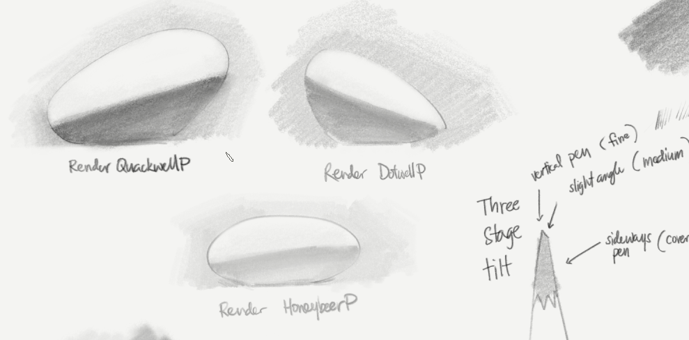

# EnpitsuP - Pencils and Drawing Brushes for Clip Studio Paint
## Changelog

- **Shop page:** [https://ko-fi.com/pharanbrush/shop](https://ko-fi.com/pharanbrush/shop)

---
## 2021

### 2021 Sep 20

Added **IroEnpitsuP 2021**. A 3-stage tilt version of IroEnpitsuP for both lines and shading.

Added **Rule Lines Borupen** to BorupenP Plus, a Ballpoint pen parallel line tool.

I've uploaded a beta version of the shading-and-rendering-centric Render EnpitsuP pencils: **Render HoneybeerP**, **Render QuackwellP**, **Render DotwellP**, **Render StumpwellP** and **StumpitsuP**. They can be found in a separate zip file.(These brushes require pen tilt support.)

### 2021 Aug 2

Added **BorupenP WobbleWrite** to BorupenP Plus. It's like writing on a sheet of paper with a rough surface underneath. (Updated this twice today to improve the light-pressure shading behavior.)

### Jul 2021 : MAJOR UPDATE

Added **DarkwellP** and some **extra variations of QuackwellP**.

Added **DuckwellP EKonte** - which combines clean pencil lines and textured tilt shading of DuckwellP. Replaced the main fixed color pencils with DuckwellP EKonte.

Added **Tail Tzu Pen** a ruff drawing brush pen.

Added **DuckwellP Chewed**. A roughened outline version of DuckwellP.

Added **BorupenP Plus**.

Added **Whippink** (the drawing-version the line brush from the Tapioca Whip Chalk set).

**Renamed and retuned the Superclean Linework brushes**. These are plain digital inking brushes that have different density, softness and overlapping characteristics. The base unnamed size is now the "300 dpi" set (previously labeled 2x). The small version is labeled 150, and the large version labeled 600. These correspond to the ideal ppi they're used at. There's a guide image that better illustrates their differences in the "Tips" folder.

**Updated the images and previews** to be more descriptive and less chaotic.

Fixed: **Ms Calico** was added to the "Digital Drawing PharanBrush Common" file.

### 2021 Jul 23

Added **BorupenP Plus**. Gumroad puts a size limit on free items so I'm putting the extra special but BorupenP-related brushes here. This now contains:

- **KureyonP**
- **ChalkwellP**
- Double-line versions of BorupenP
- Hatchy BorupenP brushes
- related erasers.

---

## 2020

### 2020 Oct 21

Added new pencils: **QuackwellP** and **DuckwellP** ! Also moved **SmudgepitsuP** out of the meme folder because it turned out it's more broadly applicable.

### 2020 Oct 8

Added **GraphiteP** and updated the documentation to explain settings and to reflect the EnpitsuP pack's variety.

### 2020 Aug 28

***VERSION 3.0 RELEASE***

EnpitsuP set now includes both pencils and various non-pencil drawing tools and inkers!

Added **BorupenP ShortHatches** - a hatching shading ballpoint pen brush.

### 2020 Apr 12

**Fixed Color EnpitsuP** - I've included 4 new EnpitsuP variants that come with a color (and ignore the color you selected). This is useful for when you want to frequently switch between colors AND brushes or don't want to lose the color you selected.

It can be especially useful on iPad or keyboardless Cintiq setups where changing the tool and the color may require a lot of extra hand movement.

### 2020 Mar 1

IroEnpitsuP F texture fix. The texture repeat on the F variants of IroEnpitsuP has been doubled and patched up to greatly reduce the obvious repeating pattern.

### 2020 Feb 2

**Render EnpitsuP** : This is EnpitsuP with curves adjusted a bit for less randomness and more control, to allow it for use in carefully rendering forms. Also reduced the texture density a bit to that end.

---

## 2019

Oct 8

MAJOR UPDATE. Added GraphiteP and updated the documentation to explain settings and to reflect the EnpitsuP pack's variety.

Oct 3

Added extra IroEnpitsuP variants for more grain choices, some adjustments to existing brushes. New Tapering DigiEnpitsuP.

Sep 27

Slight update to EnpitsuP, and exposed the direction slider, slight tilt response to add slight size and opacity variation when tilted.

Plus a bonus message.

Sep 17

Added RoughPaper EnpitsuP and Susai Sketch EnpitsuP

These are faint pencils designed to be used for minimal undersketches for watercolors, gouache or other similar styles.

The default EnpitsuP has also been modified to be slightly more sensitive to tilt if you have it.

Sep 2

Fixed the Line version of IroEnpitsuP to be less harsh.

Sep 1

Added IroEnpitsuP! Try it out!

Aug 28

EnpitsuP V2.0 !

The high resolution set has become the new default set (ie, "EnpitsuP is now the updated 300dpi brush). The old default set is now named the "SD" set.

Replaced the backing texture, smaller file sizes and hopefully better performance on lower-specced computers. Replaced [EnpitsuP] to be more versatile and lively, suited for most sketching and drawing purposes. Hopefully, this new version is more enjoyable to use. (Use "Wear EnpitsuP" if your pen does not support tilt)

July 27

Improved [L EnpitsuP] and related pencils to be less harsh and weird-looking when zoomed in at 100%.

July 23

Fixed a problem with too much pressure response on EnpitsuP circle brush size. It tended to be even more streaky when used at blurry settings.

---

Some helpful reading:
- [How to install CSP brushes](how-to-install-csp-brushes/)
- [Too many brushes? Brush Management Tips for Clip Studio Paint](brush-management-tips/)
- [Pen direction support in Clip Studio Paint](/clip-studio-paint-direction-of-pen/)

