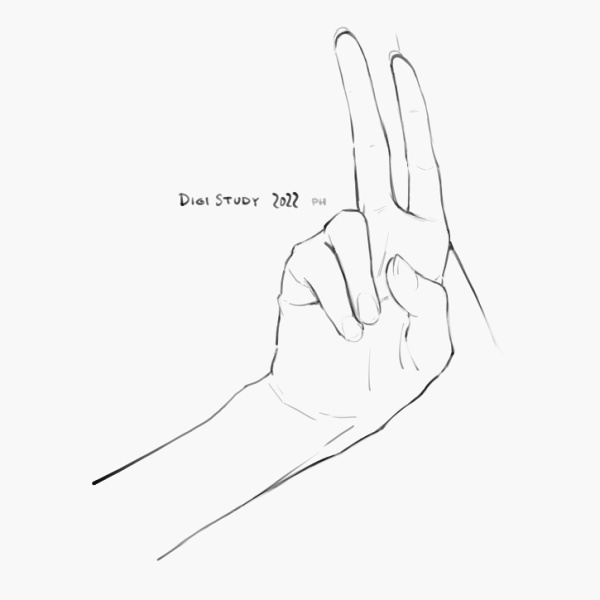

# EnpitsuP

- **Shop page:** https://ko-fi.com/pharanbrush/shop
- **Changelog:** [EnpitsuP changelog](../enpitsup-changelog)  

These brushes, or parts of them (textures, stamps, brush shapes, icons), are not free for redistribution or resale.
Don't use any part of them in your products. Just use them as tools in Clip Studio Paint.

---

EnpitsuP is a set of brushes designed for drawing, inking and sketching. This set includes a variety pencils and shading tools, and natural and digital line art, drawing and ink brushes.

## What's Included?

This brush set is separated into:
- **EnpitsuP** - pencil brushes (including *SmudgepitsuP* smudger)
    - **Render EnpitsuP** - a subset of pencils with different textures designed for maximum tone control. (currently a different file in beta)
- **Natural Pens** - gel and technical pen inking and drawing brushes
- **Digital Drawing** - drawing brushes that don't try to look like the natural media.
    - **Digital EnpitsuP** - more opaque, non-natural-looking versions of EnpitsuP and BorupenP.
    - **Superclean Linework** - Plain inking brushes, designed for different levels of softness, density and resolution.
- **EnpitsuP Settei** - even-width versions of select brushes from EnpitsuP and BorupenP, good for animation tests, character sheets, writing, etc.

It also includes:
- Some utilities such as fill tools for filling sketches, and plain shapes.
- Meme brushes
- PharanBrush Common Erasers
- **BorupenP Plus** - special versions of BorupenP brushes and a few extras in the same theme.

---

### EnpitsuP

EnpitsuP includes a set of natural looking pencils and their digital-looking counterparts, useful for different styles.

> **Can be found in:** Main Enpitsu set>Brushes>1.Enpitsu

> **Can be found in:** Main Enpitsu set>Brushes>1.Enpitsu

> **Can be found in:** ph Render Enpitsu set (ph-RenderEnpitsu-Beta)

> **Can be found in:** Main Enpitsu set>Brushes>1.Enpitsu

> **Can be found in:** Main Enpitsu set>Brushes>1.Enpitsu

### Natural Pens

There are a few natural pens that approximate technical, gel and nib pens with their taper and slight fringing.

> **Can be found in:** Main Enpitsu set>Brushes>2.Natural Pens

**BorupenP Plus**

> **Can be found in:** ph BorupenP Plus set >

### Digital Drawing

The EnpitsuP set includes various drawing and inking brushes with various levels of roughness and tapering.

> **Can be found in:** Main Enpitsu set>Brushes>3. DD Digital Drawing  
> **Can be found in:** Main Enpitsu set>Brushes>3. DD Digital EnpitsuP

> **Can be found in:** Main Enpitsu set>Brushes>3. DD Digital Drawing

> **Can be found in:** Main Enpitsu set>Brushes>3. DD Digital Drawing

### Superclean Linework

Superclean Linework is a set of plain inking brushes of varying density, softness, tapering and resolution.

> **Can be found in:** Main Enpitsu set>Brushes>3. DD Superclean Linework

### Erasers

The set includes the small set of PharanBrush erasers.

> **Can be found in:** Erasers-PharanBrush-Common >

Use **Electric EraserP** for natural-looking small erasures. This can also be used to draw white details.

### EnpitsuP Settei

These are even-width versions of select brushes from EnpitsuP and BorupenP, good for animation tests, character sheets, writing, etc.

You can read more about it here: [https://pharanbrush-log.tumblr.com/post/690514861842726912/](https://pharanbrush-log.tumblr.com/post/690514861842726912/)

> **Can be found in:** EnpitsuP Settei set >

---

## Some Tips

Many of these brushes were designed around a specific size. Most of them have some flexibility for increasing or decreasing the brush size. But if you resize them too much, they may start to look weird.

Some of the pencil brushes are set to the **[Compare Density]** blend mode by default. This is to partially reflect how pencil marks partially block further pencil marks from going on the page, and should help make drawings look less messy.

However, certain styles of drawing and shading do require building up pencil marks on top of each other slowly. In this case, you may need to swich the brush blend mode to **[Normal]** or **[Multiply]**. 

---

---

