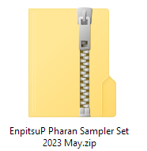

## Getting Started

If you already purchased one of my brush packs, you probably know that there are hundreds of brushes in them. For a lot of people, it would be overwhelming to try to install all of them immediately, or read the documentation to figure out everything before knowing how to navigate or organize them.

To help you ease into my brush pack packs, I've included a "Getting Started" file with each pack. These are a selection of brushes that represent the pack's "main" and "most-likely-useful" brushes.

Look for the file that has "Getting Started" in the name. You can just install the brushes in those few folders and try them out right away to get a feel for which one suits the way you draw or paint. No need to read through the documentation first.

The majority of the brushes in the full set will be variations of these main brushes so if you find something in the starter set but wish it could be slightly different, it might be in the full set. If not, feel free to contact me.

---

For questions or support:

- Twitter : [@PharanBrush](https://twitter.com/PharanBrush)
- Tumblr: [PharanBrush](https://pharanbrush.tumblr.com/)
- ko-fi: https://ko-fi.com/pharanbrush
- email: pharanbrush@gmail.com

You can also [join the PharanBrush discord](https://discord.gg/NRdMxczDc3) server.

---



