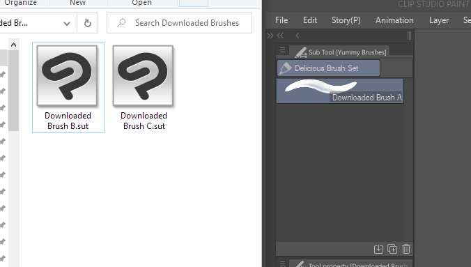
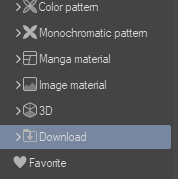
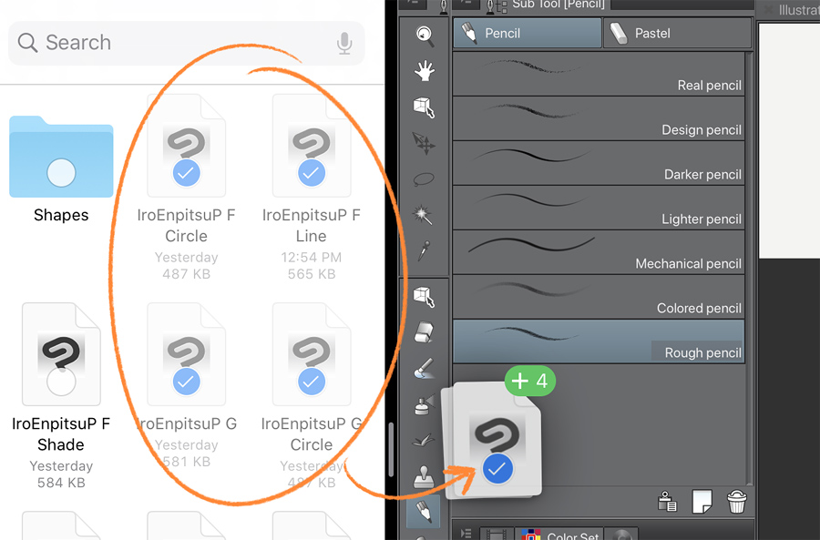

# A quick way to install custom brushes in Clip Studio Paint

Clip Studio Paint brush files have the file extension .sut (meaning “sub tool”, which is what “brushes” are called in CSP).

## How to install brushes

There's a number of ways to install brushes. But you usually download multiple brushes in a pack, so you'll usually want to install multiple brushes at once.

The fastest way to install multiple brushes is to select them in your file manager (File Explorer, Finder, Files App), and drag them into Clip Studio Paint's [Sub Tool] Palette. The [Sub Tool] palette is the palette that shows a list of brushes under a tool.

  
Drag-and-drop files into the [Sub Tool] palette to install.

1. Make sure your files are visible in your file manager.
2. Make sure Clip Studio Paint is open. And the [Sub Tool] palette is visible.
3. In Clip Studio Paint, select the tool you want to import them under.
4. In your file manager, select the downloaded brush/sub tool files.
5. Drag them into the [Sub tool] palette inside Clip Studio Paint.

And that's it! You'll see the brushes added to the list and you can use them like your other brushes.

> Alternatively: There's also an [Import sub tool...] menu option. But that only allows you to import one file at a time.

## Brushes from Clip Studio Assets

Note that this can also apply to sub tool materials you get from the [Clip Studio Assets](https://assets.clip-studio.com/en-us/) site. Brushes downloaded from the Assets site get added to your Materials library instead of as files.

After downloading brushes from the Assets site, you need to browse your Materials library to find the brushes/sub tools you downloaded. Then just drag them to the [Sub Tool] pallete.

Clip Studio Paint lets you open multiple [Materials] windows so just open one (go to on Window>Material>choose any of the options) and navigate to where the brushes are. You'll normally be able to find them in the **Download** folder.

  

## Importing brushes to Clip Studio Paint for iOS

The iOS Files app has the ability to unzip files.
  

Tapping the zip file in the iOS Files app will extract the files in that folder.

You can use [iPadOS Split View or Slide Over](https://support.apple.com/en-ph/HT207582) to drag the files from the Files app to the Clip Studio Paint app.
  

If the brushes are not inside a compressed folder, brushes can be imported via drag-and-drop from apps like Google Drive or Dropbox.

However, those apps can sometimes push out updates that make this not work. If this happens, you can try to move those files onto your iPad storage first, and then use the Files app to drag the files from the folder and into the [Sub tools] palette.