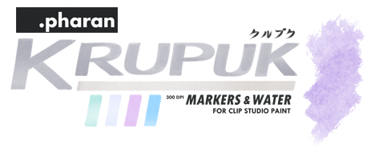

## PharanBrush

You can find my brushes at [my shop](https://ko-fi.com/pharanbrush/shop).

If you are having trouble with payments through the ko-fi shop, you can try the [PharanBrush gumroad store](https://pharan.gumroad.com) as an alternative.

---

### Getting Started

Each of my brush packs have over a hundred brushes in them. Depending on how you want to proceed, I'm trying to provide more options to discover what brushes you might like or find useful, from swatches, videos, tips images and sampler sets.

Visit the [Getting Started](getting-started) page for more info.

### Brush Pack Documentation
- [Brush Store](https://ko-fi.com/pharanbrush/shop)

   [Overview](enpitsup-overview) \| [changelog](enpitsup-changelog) |    [Overview](krupuk-overview) \| [changelog](krupuk-changelog) 
   [Overview](tapioca-overview) \| [changelog](tapioca-changelog)  |    [changelog](borupenp-changelog)

---

These brushes, or parts of them (textures, stamps, brush shapes, icons), are not free for redistribution or resale.
Don't use any part of them in your products. Just use them as tools in Clip Studio Paint.

---

For questions or support:

- Twitter : [@PharanBrush](https://twitter.com/PharanBrush)
- Tumblr: [PharanBrush](https://pharanbrush.tumblr.com/)
- ko-fi: https://ko-fi.com/pharanbrush
- email: pharanbrush@gmail.com

You can also [join the PharanBrush discord](https://discord.gg/NRdMxczDc3) server.

---



