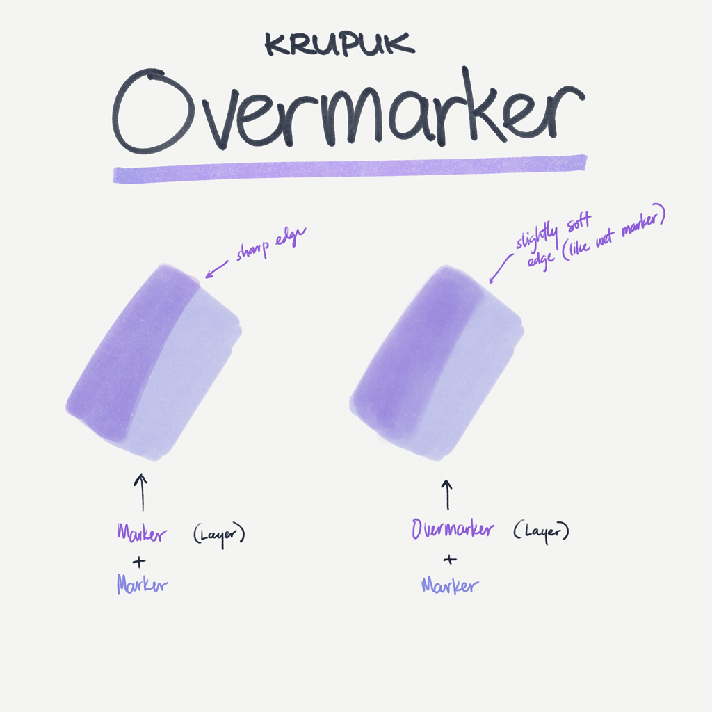
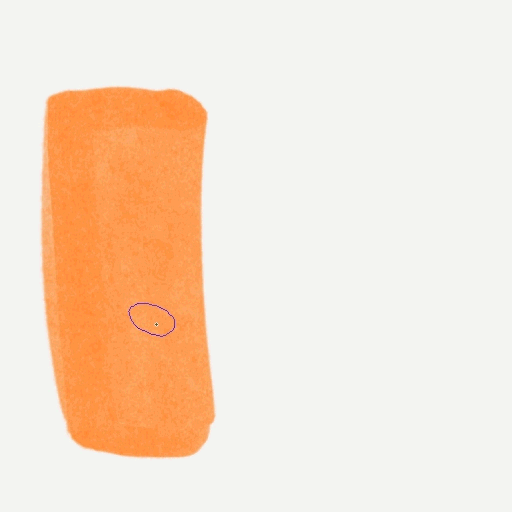
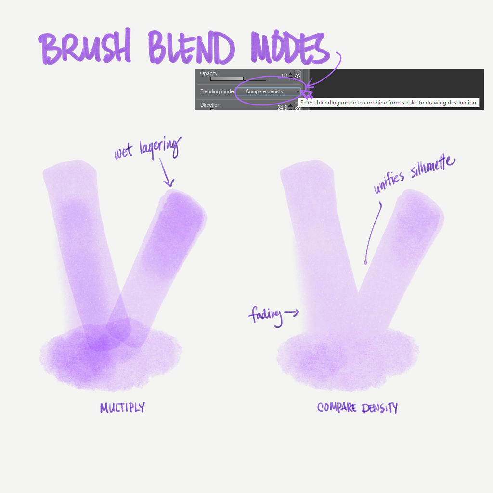

# Krupuk - Markers and Water Brushes for Clip Studio Paint
## Overview

**Shop page:** [https://ko-fi.com/pharanbrush/shop](https://ko-fi.com/pharanbrush/shop)

**Krupuk Markers and Water** is a set of Clip Studio Paint brushes that try to look like markers and thin, water-based media, with various shapes and amounts of grain and texture.

This was originally a set of brushes to help me quickly do quick coloring on sketches, but I later expanded to be able to achieve a broader set of marker-like looks.

---

## Included in the set
- **Krupuk** (the main set)
- **Kropek** - the experimental dual brush variants of Krupuk
- **Krupuk Inkers** - water-based inking brushes with color dynamics
- **Shibe** - the experimental blendable layer setup
- **Script Tzu** - Asian calligraphy brushes

---

### Krupuk

Krupuk is separated according to its grain, which are scans of different kinds of paper.
- **CP** is regular printer paper, which tends to look more like an everyday marker drawing, with characteristic white spots.
- **SP** is light-medium () sketchpad paper which shows a little bit of paper grain.
- **SPG** is the sketchpad paper but with more visible granules, to look more like certain grainy pigments.

Each category has a variety of shapes, softness and fuzziness. For example **Chisel** is for chisel tip markers. **Fine** is for fine-tip. **Marker** is for a general ovoid shape. Use **Haze** as a soft brush. There are several other shapes too.

There are also variations for how deep the color is. Some markers have **Mid** and **Light** variants. The **Mid** variants help show the actual picked color better when that's the desired effect.

More recently, Clip Studio Paint has added the ability to adjust the **Brightness** and **Contrast** of the texture. You can also adjust these sliders to make the color more dense and better show the picked color.

Krupuk also includes a set of **effects brushes** that help achieve certain effects.

### Kropek

**Kropek** is the smaller set of dual brushes compatible with Clip Studio Paint's updated brush engine (1.10.x). These allow the paper texture and brush texture to show through on the edges for a dry brush look. These can be combined with the regular Krupuk set as long as you match the color density and paper texture.

These also include the WCB paper texture.

### Krupuk Inkers

**Krupuk Inkers** are thick, inking brushes that look water-based. They have pressure-responsive color dynamics so it darkens and saturates as you press harder, mimicking dense colored specialty inks.

### Script Tzu

**Script Tzu** is a small set of Asian calligraphy brushes.

---

## Krupuk Tips

Here are some tips and how-tos that are included in the pack.

(character Dusk belongs to [@duskwalker](https://twitter.com/duskwalker_))

---

Choose between *Compare Density*, *Normal*, or *Multiply* depending on what you're working on.

In the absence of an actual water engine in Clip Studio Paint, the set comes with a variety of brushes that help add an unevenness effect without too much extra effort.

---

