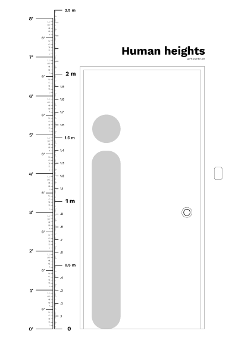
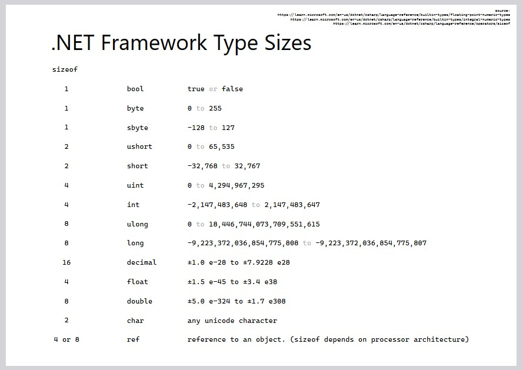

# Printables

If you found some of my free stuff saved you time, money and sanity, please consider supporting PharanBrush!

In exchange, you'll also get this set of printable charts and diagrams.

**Shop page:** [https://ko-fi.com/pharanbrush/shop](https://ko-fi.com/pharanbrush/shop)  

**Printables Donation Pack**: [https://ko-fi.com/s/49ef6db666](https://ko-fi.com/s/49ef6db666)  

(This pack is also included for supporters via Discord)

---

Most of the A4-sized charts have space where you can mark your own important information.

The 3x3 charts are designed to fit in a 3x3 sticky note.

---

### For Artists/Animators
**a-frames-per-second-a4.pdf**  
  
- A chart of frame rates and time per frame, visualizing which ones are divisible or overlap. Includes GIF framerates showing the limitation of 0.01 increment frame delays. This is also useful for game programmers who have to deal with animation frames.

### For everyone
**human-heights-a4.pdf**  
  
- A human height chart to help you convert between feet/inches and meters. Also has a door height for reference and extra space where you can draw other heights you may find useful

**g-temperature-celsius-fahrenheit.pdf**  
  
- A Celsius and Fahrenheit temperature conversion chart for weather and cooking temperatures, with space to mark your own important temperatures.

**g-time-12-24-3x3.pdf**  
  
- A small diagram showing where the 24-hour time format numbers go above 12 in a 12-hour analog clock. (eg, 21:00 is 9pm)

**g-percentages-and-reciprocals.pdf**  
  
- A chart for common numbers and their reciprocals, useful for checking and undoing scaling up and scaling down.

### For Techincal Artists/Programmers
**p-angles-and-portions-a4.pdf**  
  
- A common angles and portions chart, which translates what an angle means in terms of portion of space (essentially, the sine function). Common angles include 45, 30, and 60 degrees.

**p-csharp-net-framework-type-sizes.pdf**  
  
- Quick info of list of .NET framework types. This is useful for Unity/C# programmers as a quick sanity check for what range/precision their data is capable of holding.

**p-offset-point-center-3x3.pdf**  
  
- A common formula for finding the values of a point, a point of reference ("center"), and an offset. And a helpful visualization for the formula.

### For Print Designers
**d-point-thickness-3x3.pdf**  
  
- A small chart of lines ranging from 0.25pt to 2.0pt for checking how thick these point sizes are when printed. (Make sure your print settings is set to 100% scale. Set print quality to "Best" to get the maximum range of possible lines on your printer. Some printers may not be able to represent 0.25pt.)

---

You can find these printable PDFs in my shop.

**Shop page:** [https://ko-fi.com/pharanbrush/shop](https://ko-fi.com/pharanbrush/shop)  

**Printables Donation Pack**: [https://ko-fi.com/s/49ef6db666](https://ko-fi.com/s/49ef6db666)  