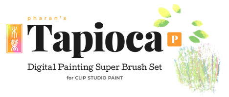
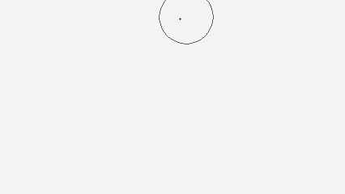
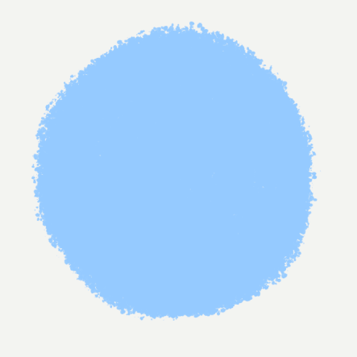

# Tapioca - Digital Painting Brushes for Clip Studio Paint
## Changelog

- **Tapioca does not include EnpitsuP and Krupuk. Those are separate brush sets.**
- **Shop page:** [https://ko-fi.com/pharanbrush/shop](https://ko-fi.com/pharanbrush/shop)
- **Overview page:** [Tapioca overview](../tapioca-overview)

---
## 2021

### 2021 Nov 19

**I'm ready to to call this Tapioca 2.0.** It's been updated to use various new features in Clip Studio Paint 1.10.x and 1.11.x like color dynamics, Dual brush and the new Smear blend mode, where they improve usability.

As with the other updates, this a free update for anyone who has previously purchased this pack.

These will require the new Clip Studio Paint update (version 1.11.x)

**Changes to brush organization:**

- The main Tapioca set will have a greater emphasis on the digital-looking brushes. To this end, the Tzu brushes will be separated out into their own files in Seasons which correspond to the different similarly-designed brushes taking advantage of new CSP brush features. This is me partly wanting to retire brushes that don't look as good to me as the new ones, but on the other hand, they still have good uses. So:
    - **Season 1** (2019) is GouacheTzu.
    - **Season 2** (2020) is RiceTzu, ButterTzu, ToastTzu.
    - **Season 3** (2021) introduces dual brushes, Edamame, ConfectionTzu, NinetiesTzu, and a new HardTzu texture.

- **EnpitsuPaint and Felt** will be its own set, featuring versions of pastel-y EnpitsuP brushes specially tuned for painting, as well as some felt-themed brushes.
- The gas-themed **Pipton** brushes like smoke, clouds and fire are now named **Gaston**. They will still be grouped together into the shape-themed set containing Pipton, Seasalt and Leif.
- **Paint Utilities** is now a separate set, which includes some useful tools like the Antibanding Spray, Create Vignette Layer gradient tool and Chalk Fill tools.

### 2021 Feb 26
#### Tahini (new brush set)

**Tahini** is a set of basic, very dense brushes, with solid, non-circle shapes. They are mostly an alternative to basic round brushes but with a little extra pen tilt response, optional slight blending.

Like Photoshop painting, these are also designed to be useful if you want to decrease the brush opacity manually. They are optionally slightly blendy. These brushes are designed so you can switch between blending and no-blending depending on your painting step or preferred style. Blending reduces the edge noise when you paint over previous strokes.

Dense, plain, opaque brushes like this are for advanced use and require that you have a good command of colors and contrast for them to be useful. In the same sense, they also make good brushes for studying how to use colors.

Also includes **Tahini Pharan Blur** for basic blurring.

#### Felt (New brush set)

This is a small set of PS-style slightly-textured painting brushes.

This includes ph **Felt** and **Radish Kore**.

**Kommand Ruffer** and **Kommand Plain Ruffer** were also added to the Ruffers.

#### New RiceTzu shapes

**RiceTzu SP Seeds**, **RiceTzu PL Seeds** and **RiceTzu SP Sesame** have been added. These are simple one-sided textured shapes for better clarity while still having texture.

#### ToastTzu

ToastTzu brushes are some brushes that use the new brush blend modes in Clip Studio Paint 1.10.5. They are included in the existing Tzu set.

#### Seasalt Confection

**Seasalt Confection** is a powdery spray brush. **Seasalt Confection Shade** has a more neutral particle shape, variable density and particle size response to pen pressure good for shading.

These brushes can be found in the **Pipton and Shapes file**.

---

## 2020

### 2020 Dec 17

**Tapioca Version 1.5 is out!**

**Most of Tapioca's existing brushes have been updated to use the new features in Clip Studio Paint 1.10.5.** This includes some of them having a slight per-stroke color variation by default, enabling randomized flipping where it helps, exposing new brush controls in the sub-tool palette, and some minor adjustments to make them

- Some older brushes become redundant as I design new brushes with the same purpose, so I'll be retiring some brushes from Tapioca, especially to keep the brush count from going out of control and keeping the set easier to understand.

- Some brushes in development that previously didn't make the cut became usable thanks to the new brush features. They have been added.

- Some documentation was updated to reflect the new look of the brushes, with better summaries, and extra tips on Clip Studio Paint's new features.

- Pizza brushes (mostly flat brushes with a diagonal tapered shape) were added to the **Pharan**, **Radish** and **Tzu** sets.

- A new brush set called **Twocolor** was added. These are brushes that use both your primary and secondary color for added but controlled color variation.

- (Dec 16) **Pipton, Leif and Seasalt, and Whip brushes are now in separate zip files**. They have been updated to get better results with the new features and they look noticeably better than previous versions. These brushes will be in a separate file from now on to help make it easier to update. Also updated **GouacheTzu**.

### 2020 Nov 26

I've included **beta versions of some of my new Pizza** brushes since I thought they were cool and people are currently getting brushes from also getting CSP. But I'm also in the process of rearranging the files in the main set, and considering what changes I need to make when Clip Studio Paint 1.10.5 comes out, so I can't update the zip file just yet.

If you want to try them out, make sure you download the Tapioca Pizza file!! They work best with pens that support pen direction!

### 2020 Sep 4

Added **Pharan Brush 2020-2** and recommended one-brush-for-most-things image.

---

Some helpful reading:
- [How to install CSP brushes](how-to-install-csp-brushes/)
- [Too many brushes? Brush Management Tips for Clip Studio Paint](brush-management-tips/)
- [Pen direction support in Clip Studio Paint](/clip-studio-paint-direction-of-pen/)

