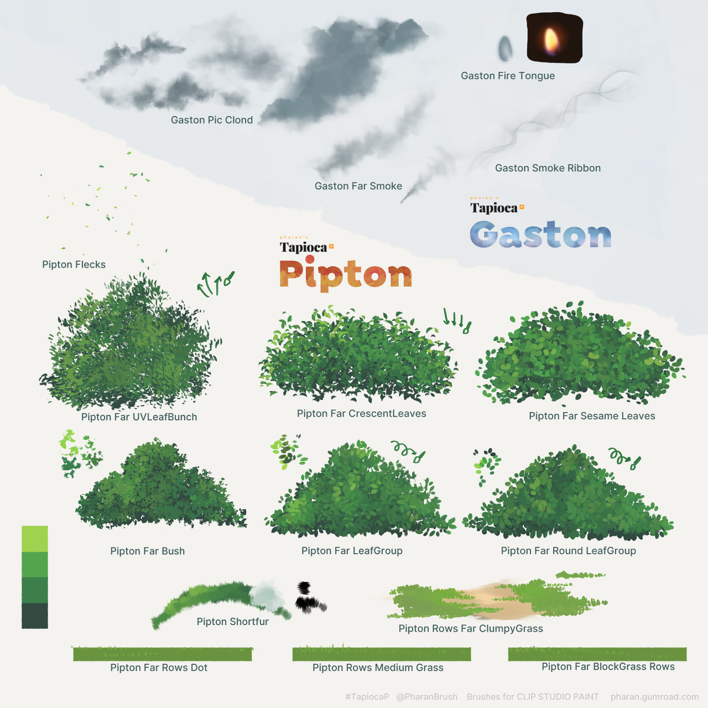
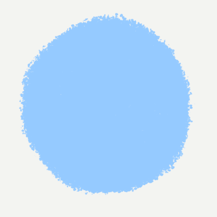

# Tapioca - Digital Painting Brushes for Clip Studio Paint

- **Shop page:** https://ko-fi.com/pharanbrush/shop
- **Changelog:** [Tapioca changelog](../tapioca-changelog)
- **Tapioca does not include EnpitsuP and Krupuk. Those are separate brush sets.**

Tapioca is multiple sets of brush sets. Each set has a theme that helps you achieve a certain look or task.

I tried to design these brushes to save time, get paintings done and be fun to use.

I made this set to fill in what I wanted from Clip Studio Paint for digital painting: basic things like reliable blenders, to blendy brushes with varying amounts of smoothness/texture and grit, brushes that help me adjust, smooth or distress edges, reliable fill tools, and more specific things like shaped brushes for abstract, painted-looking leaves, bushes and smoke.

Many of these were designed to be usable for finished works, and with some careful use, combination and adjustment, they can help you make things look very polished or getting to the polishing step faster. But I think a large benefit of some of these brushes is also for quick sketches, where something just needs to look like something quickly to get an idea across.

As I see and try more techniques and styles, I'll continue to add more brushes to this set. And I'll fix old brushes if I find a way to make them better.

## Tahini
A set of digital-looking brushes, some plain with varying hardness for maximum control, some bristly for a little bit of character while maintaining its clean look. The brushes in this set try to be the replacement for "just use a basic brush" to give the artist control.

---

## Blenders
Tapioca also includes various blending brushes.



---

## SIGH Suisai
A small set of plain blendy-blurry brushes. (In CSP 1.11.x, there's a problem with Density of Paint when using the Running color mixing mode so these brushes may not function as intended until a future update fixes it.)

---

## Tzu
Various high-texture brushes for different purposes, including blenders. These are separated into seasons, corresponding to Clip Studio Paint introducing new brush engine features. The newer seasons take advantage of new features.

---

## EnpitsuPaint
These are some EnpitsuP brushes (the main set is a different pack) that have been tweaked for dynamics, brush size, shape and texture, to be better for painting. It also includes some Tapioca-exclusive pencil painting brushes like EnpitsuPaint Dash.

---

## Ruffers & Wall

These are large, rough brushes that were made to cover large areas, with some pleasant edges or stroke-overlapping properties. They're useful for doing quick backgrounds, or if your work demands it, getting large surfaces done to about 80% so you can paint the remaining details manually.

---

## Whip Chalk

Whip Chalk is a small specialized set of brushes that help quickly paint directional or radial brush streaks for whip pans and blurred speeding or abstract backgrounds. The set includes rulers, a few brushes that generate a palette/fill an area with a base pattern, and various brushes for painting individual strokes manually. These are useful for comics and animation backgrounds.

---

## Pipton and Gaston

These are preshaped brushes that help you paint things that otherwise require a lot of repetitive brush strokes, or painting and erasing and switching tools. 

---

## Leif

These are shaped brushes that are meant to paint little details manually like grass, leaves and other plants, but also other similarly linear or blobby shapes. Some of them can also be used for general detail painting.

---

## Seasalt

These are particle brushes for use with shape-oriented grainy shading or to add grit to certain parts or shapes of other styles.

---

## Silhouetters

A small set of brushes based on the various other sets, specifically designed to add texture and character to edges to make them less perfectly clean, or adjust and sculpt the edges of the shape.



---

## Paint Utilities

This set includes painting utility brushes like buckets and fillers, color-pullers for refraction/heat distortion effects, a spray for reducing gradient/soft brush banding, a preset gradient tool that creates a new layer as a vignette.



---


